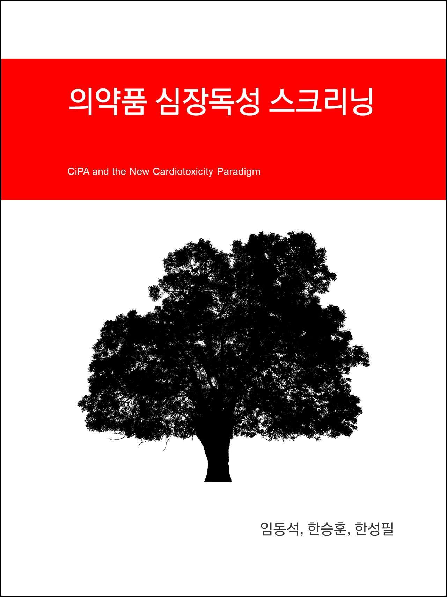

--- 
title: "의약품 심장독성 스크리닝"
author: "가톨릭대학교 의과대학 임동석, 한승훈, 한성필"
date: "`r Sys.Date()`"
site: bookdown::bookdown_site
output: bookdown::gitbook
documentclass: book
bibliography: [book.bib, packages.bib]
biblio-style: apalike
link-citations: yes
github-repo: rstudio/bookdown-demo
description: "This is a minimal example of using the bookdown package to write a book. The output format for this example is bookdown::gitbook."
---

# 책 머리에 {-}

신약으로 개발 중이거나 개발된 약물들의 궁극적인 경쟁력은 '안전성'에 달려있다. 특히 급성 독성인 심장독성은 매우 중요한 안전성 인자로서 치명적 부정맥 증상인 Torsade de Pointes(TdP)으로 인해 몇몇 약물이 시장에서 퇴출되었다. 심실 빈맥의 한 형태인 TdP란 특정 유형의 비정상적인 심장 리듬으로서 급성 심장사를 유발할 수 있다. 약물이 심근세포의 다양한 이온 통로에 영향을 미쳐, 심실 수축 후 재분극 과정을 연장시키며, 이는 약물이 TdP를 일으킬 수 있는 직접적인 원인이 된다.

# 배경

## 약물 유발 심장 독성(drug induced cardiac toxicity) 

신약으로 개발 중이거나 개발된 약물들의 궁극적인 경쟁력은 '안전성'에 달려있다. 특히 급성 독성인 심장독성은 매우 중요한 안전성 인자로서 치명적 부정맥 증상인 Torsade de Pointes(TdP)으로 인해 몇몇 약물이 시장에서 퇴출되었다. 심실 빈맥의 한 형태인 TdP란 특정 유형의 비정상적인 심장 리듬으로서 급성 심장사를 유발할 수 있다. 약물이 심근세포의 다양한 이온 통로에 영향을 미쳐, 심실 수축 후 재분극 과정을 연장시키며, 이는 약물이 TdP를 일으킬 수 있는 직접적인 원인이 된다.

목       차

1. 배경	1
  1-1. ICH 가이드라인	1
  1-2. CiPA 프로젝트	1
2. 심장독성 스크리닝과 관련한 일반론	2
  2-1. ICH S7B	2
  2-2. ICH E14	3
3. 안전성 약리학회 동향	3
4. 선진국 정책 동향	4
  4-1. TQT 연구를 1상 임상시험에서 통합하여 임상평가 간소화	5
  4-2. ECG 데이터를 사용하여 새로운 심전도 바이오마커 개발	5
  4-3. CiPA 	6
5. 추천되는 해석 및 활용 방법론	6
  5-1. 이온채널 실험을 통한 심근세포 활동전위 변화의 예측	6
  5-2. CiPA in silico 모델 해석	7
  5-3. 줄기세포 유래 심근세포를 이용한 전기생리 실험과 해석 	8
  5-4. 임상 심전도 평가와 적절한 마커의 선정	8
6. 합리적 신약 심장 스크리닝 정책을 위한 제언	9
7. 참고문헌	11

  부록. 재조합 세포주를 이용한 심장 이온채널 약물 평가 권장 전압 프로토콜	12

1. 배경

  1-1. ICH 가이드라인

 Torsade de Pointes(TdP)란 특정 유형의 비정상적인 심장 리듬으로서 급성 심장사를 유발할 수 있으며, 일부 의약품들은 심근세포의 다양한 이온 통로에 영향을 미쳐, 심실 수축 후 재분극 과정을 연장시키며, 이는 TdP의 가능성을 증가시키는 직접적 원인이 된다. 신약 후보물질의 TdP의 유발 가능성을 정확하게 판단하는 것은 신약 개발 및 임상시험의 안전성을 확보할 수 있는 필수적인 기술이다.

 2005년, 국제 의약품 규제조화 위원회(the International Council for Harmonisation of Technical Requirements for Pharmaceuticals for Human use, ICH)는 현재 TdP 유도 가능성에 대한 평가의 큰 틀이 되는 S7B(의약품의 심실 재분극 지연(QT 간격 연장)에 대한 비임상 평가) 및 E14(비 부정맥 치료제에 대한 QT/QTc 간격 연장 및 proarrhythmic 가능성의 임상평가)가이드라인을 발표하였다. 현재까지 위 두 가지 가이드라인은 신약 후보 물질의 TdP 유도 가능성에 대한 평가를 위한 가장 중요한 기준이었으며, 평가방법 자체의 민감도(sensitivity) 역시 매우 높은 편이었으나, 특이도(specificity)가 낮아 신약 개발의 장애물로 작용하기도 하였다. 즉 실제 심독성이 없는 의약품도 허가를 위해 광범위한 심전도(Electrocardiogram, ECG) 연구를 수행하여야 하거나(임상 개발 비용 급증), 의약품 사용설명서에 주의 사항을 삽입(의약품의 가치 하락)해야 할 가능성이 높았다. 따라서 TdP 유도 가능성 평가를 위한 새로운 패러다임이 제시되어야 할 필요성이 대두되었다.

  1-2. CiPA 프로젝트 

 이러한 노력으로 시스템 생리학적 모델을 활용한 정량적 시스템 약리학 등 in silico 생물학적 실험과 관련하여 컴퓨터에서 또는 컴퓨터 시뮬레이션을 통해 수행됨을 의미
 방법이 활발히 연구되었다. 즉, 1∼2개의 바이오마커에 의존하는 것이 아니라, 여러 개의 후보물질 또는 그 대사체가 각 이온 채널에 미치는 영향을 종합적으로 분석하여, 심실 재분극 패턴을 예측해 볼 수 있는 기술을 확보할 수 있게 되었다.

 2013년 7월, 미국 FDA 본부에서는 Cardiac Safety Research Consortium (CSRC), Health and Environmental Sciences Institute (HESI)와 함께 TdP 유도 가능성 평가를 위한 새로운 전략을 논의하기 시작하였다1. “The comprehensive in vitro proarrhythmia assay (CiPA) initiative”에서 제시한 접근법은 자동화된 고수율(high throughput) 방법을 사용하며, 부정맥 기전에 대한 지식을 기반으로 이온 채널 매개성 부정맥 전위를 보다 포괄적으로 평가하는 노력이다. 1) 여러 심장 이온 전류에 대한 약물 효과를 평가하고, 2) 데이터를 in silico 모델링을 사용, 통합 하여 심실 활동을 재구성하며, 조기 후 탈분극(early after depolarization, EADs) 및 재분극 불안정성에 대한 성향을 시뮬레이션하고, 3) 인간 줄기 세포 유래의 심근 세포를 활용하여 추가 정보를 획득하고, 4) 1상 임상시험에서 ECG 바이오마커를 탐색하는 것이 그 내용이다. (CiPA 패러다임의 4 가지 구성 요소)

< CiPA 패러다임의 4 가지 구성 요소 >

 즉, CiPA의 목적은 최신 기술의 적극적인 활용을 통해 기존의 민감도는 유지하면서, 특이도를 제고하여 불필요한 신약 개발 부담 혹은 실패 가능성을 줄이겠다는 것이 그 목적이다. 기존의 S7B와 E14에서 보다 나은 방향으로 이행하는 시점에서 CiPA의 제안은 규제에 큰 영향을 미칠 수 있다. 그러나 아직 CiPA의 여러 제안에 대해 온전한 검증이 이루어지지 않았고, 기반을 이루는 요소 기술들이 우리나라 신약 개발에 적용 가능한지가 파악되지 않은 상태이다. 

 본 동향 정보집에서는 심장독성 스크리닝과 관련한 일반론을 먼저 살펴보고,  안전성 약리학회와 선진국 정책 동향을 정리하며, 국내 연구진이 파악한 CiPA의 추천되는 해석 및 활용 방법론을 제시할 것이다. 끝으로 합리적 신약 심장 스크리닝 정책을 위한 제언을 하고자 한다. 

# 심장독성 스크리닝과 관련한 일반론

## ICH S7B 

심박동은 심장을 통과하는 전기 신호에 의해 제어된다. 이 신호는 심장의 개별 근육 세포(myocytes)에서 칼슘, 나트륨 및 칼륨 이온의 통과를 제어하는 세포막의 특수 채널의 개폐로 인해 발생한다. 이온의 움직임은 활동 전위로 알려진 주기적 전기 변화를 일으키고 근육 세포가 수축하도록 신호를 보내게 된다. 약물이 하나 이상 종류의 이온 채널을 방해할 때 심장 수축을 제어하는 활동 전위 및 전류가 중단될 수 있고, 이로 인해 부정맥이 발생할 수 있다. 비임상 심장 독성 스크리닝에서는 이러한 미세한 작용을 관찰하고 인체에서의 위험을 예측한다.

ICH S7B 가이드라인^[the non-clinical evaluation of the potential for delayed ventricular repolarization (QT interval prolongation) by human pharmaceuticals, 의약품의 심실 재분극 지연(QT 간격 연장)에 대한 비임상 평가]은 전임상 단계에서 후보물질의 TdP 유도 가능성에 대한 평가 전략을 제시하며, 심실 재분극에 중점을 두고 재분극 이온 전류(IKr) 및 QTc 간격을 핵심 바이오마커로 선택하였다. S7B 가이드라인에 따라 실시되는 여러 전임상 평가의 목적은 아래와 같다.

  ○  후보 물질과 그 대사체의 심실 재분극 지연 가능성을 확인함
  ○  심실 재분극의 지연 정도를 후보 물질과 그 대사체의 농도와 연관 지음
  ○  후보 물질과 그 대사체가 심실 재분극의 지연을 일으키는 기전을 규명함
  ○  관련 정보를 통해 심실 재분극의 지연 및 QTc 간격 연장 위험성을 예측함

## ICH E14

 2005년 ICH S7B/E14 도입  이전에 승인받은 (즉, 부정맥의 위험이 과소평가된) 여러 약물이 시판 후 퇴출된 바 있다. (Levacetylmethadol, Droperidol, Cisapride 등) ICH E14가이드라인은 QTc 연장에 대한 임상평가와 항부정맥제가 아닌 약물의 부정맥 발생 가능성을 다루고 있다. 즉, E14 가이드라인에 의한 연구에서 우려되는 수준의 QTc 연장이 확인된 물질에 대해서는 약품 사용설명서 중 주의사항에 해당 내용 기재 등이 필요하게 된다.

 QTc 연장을 평가하기 위한 임상시험인 TQT (Through QT, QT시험) 연구가 E14 가이드라인의 핵심사항이다. TQT 연구에서, 건강한 연구 참가자에게는 고용량의 후보 약물이 제공되며, 심장 활동은 심전도에 기록된다. 약물에 의해 심전도상 Q와 T파 사이의 평균 시간이 10ms(millisecond) 이상 약물에 의해 연장되는 경우 임상 연구에서 추가 환자 모니터링이 필요하며 약물 개발이 중단될 수 있다.

 위 두 가지 가이드라인을 발표 한 후, 예상치 못한 TdP 위험이있는 약물은 시장에 출시되지 않았다. 그러나 규제 기관, 업계 및 학계에서는 이 가이드라인의 엄격한 적용이 약물 개발에 부정적인 영향을 미칠 수 있음을 깨달았다. 가이드라인에 제시된 전임상 및 임상 테스트에서 TdP를 유발할 가능성이 있다고 판단된 여러 약물 중 실제로 TdP가 발생하지 않는 경우가 많아, 이 두가지 가이드라인의 결과에 따라 약물 개발을 중단할 경우 실제로 환자에게 도움될 수 있는 약물이 시판되지 못하게 될 확률이 있었다.

# 안전성 약리학회 동향

Safety Pharmacology Society (SPS) 2018(Washington D.C., 미국), 2019(Barcelona, 스페인)
 안전성 약리의 화두는 동물 실험의 자료를 최대한 효과적으로 활용해 임상시험의 질을 높이고 예측도를 향상 시키는데 있다. CiPA 대부분의 내용이 안전성 약리학회에서 다루어지고 있기 때문에, 이러한 연구를 수행하는 연구진이 SPS 학회에 참여하여 세션, 강의 및 포스터 세션에 참석하여 동향을 수집하는 것이 중요하다. 특히 수집된 실험 자료를 최신 기법의 모델링과 시뮬레이션을 통해 검증하고 재현하는 작업이 활발하게 이루어지고 있는 것을 파악할 수 있다.

 주요 연구자인 B. Fermini에 따르면, CiPA는 약물 스크리닝 단계에서부터의 심장독성 평가를 high-throughput 기반으로 수행하기 위한 목적을 가지고 있으며, 다양한 연구진에 의해 광범위하게 그 가능성이 평가되었으나, 현재는 표준 실험법 또는 자동 실험법 구축에 어려움이 있어 실험실간 결과의 변이를 해결하기 어렵다는 한계점을 가지고 있다고 논하였다.

 CiPA initiative 연구진은 HEK cell Human Embryonic Kidney 293 cell, 조직배양에서 자란 인간 배아 신장세포에서 유래한 특정 세포주로 생명공학 업계에서 많이 사용됨
을 사용하였는데, 이는 FDA등 연구진이 기 확보하고 있는 세포주가 HEK cell 뿐이었기 때문이었다. 하지만 이온 채널 연구에 보편적으로 사용되고 있는 세포주는 CHO cell Chinese Hamster Ovary cell, 차이니즈 햄스터의 난소에서 유래된 상피세포로 유전학, 독성 스크리닝, 재조합 단백질 발현 연구 등에 많이 사용됨
기 때문에 FDA에서 생성한 자료와 실험조건이 다르다.

 2019년 안전성 약리학회에서는 CiPA의 연구결과가 ICH에 어떻게 반영되어야 할지에 대한 설문조사가 진행되어 학회 차원에서 연구자들의 의견을 수집하였는데, 이 내용이 정리되어 대중에 공개될 예정이다. (일정 미정)

# 선진국 정책 동향

 ICH E14 가이드라인에 따라, 2005년부터 많은 신약 화합물은 FDA가 요구했던 전통적인 임상시험 외에 약물이 치명적인 심장 부정맥을 유발할 수 있는지 여부를 확인하기 위해 TQT 연구라고 하는 별도의 임상시험을 수행할 것이 요구되고 있다. 2005년 이후 약 450건의 TQT연구가 수행되어 약 10억 달러 이상의 의약품 개발 비용이 발생하였고, 이후 부정맥 위험으로 인해 신약이 시장에서 퇴출된 바는 없었지만, TQT 접근법이 위험을 가진 약물 만 식별한다는 것은 확실하지 않았기 때문에 다음과 같은 보완이 이루어졌다.

  4-1. TQT연구를 1상 임상시험에 통합하여 임상평가 간소화
 
 FDA에서는 별도의 TQT 연구 대신, 1상 임상시험을 통해 QT 연장을 결정하기 위해 노출-반응 모델링(설명이 가능한지? 예시가 있는지?)이라는 분석적 접근을 사용할 수 있게 하였다. FDA는 ICH의 지침을 개정했으며 예외적인 경우를 제외하고  신약에 대한 별도의 전용 TQT 연구를 요구하지 않는다.2

  4-2. ECG 데이터를 사용하여 새로운 심전도 바이오마커 개발
 
 QT 간격을 연장시키는 많은 약물은 세포막을 가로지르는 칼슘, 칼륨 및 나트륨 이온의 통과를 제어하는 이온 채널과 상호 작용하는 방식 때문에 치명적인 부정맥을 유발하지 않을 가능성이 있다. hERG라는 특정 칼륨 이온 채널과의 상호 작용이 QT 간격 연장 및 부정맥의 알려진 원인이지만 QT 간격이 연장되어도 나트륨 및 칼슘 채널에 동시에 영향을 미치는 약물은 실제로 심장 리듬을 안정화 시킬 수 있다. JTpeak라고 하는 대표적인 심전도 바이오마커에 의해 이를 감별할 수 있다. 국내 연구진에 의한 1상 임상시험에서도 유사한 결과를 얻었다. (5-4 부분 참고)

< 임상시험에서 사용된 약력학 바이오마커인 JTpeak와 QT interval >

4-3. CiPA : 새로운 약물로 인한 부정맥의 위험을 예측하기 위한 더 나은 패러다임 개발

 CiPA는 심장근육세포의 각 채널 유형에 대한 약물의 영향에 대해 시험 관내 측정을 기반으로 하는 위험 예측 도구이다. 노출 반응 접근법을 사용하는 초기 단계 ECG 테스트와 결합하여 보다 구체적인 ECG 기반 바이오마커로 검증된 CiPA 툴을 제공하고 있다. 2017 FDA Advisory Committee에서 CiPA에 의한 접근법을 지지한 바 있다.

# 국내 적용 연구사례

## 이온채널 실험을 통한 심근세포 활동전위 변화의 예측

 CiPA initiative의 이온채널 활동그룹에서 발표한 다중이온채널(multiple ion channel effects, MICE) 모델에서 제안되었던 기존의 7가지 이온채널들 중 가장 큰 영향을 미치는 IKr (hERG), ICaL (Cav1.2), INa/INaL (Nav1.5 fast/late)를 선택하였다.
 Fast와 late Nav1.5, Cav1.2, hERG 채널의 활성을 기록하기 위해 patch clamp 시험법을 이용하여, 각 이온채널이 활성화 될 수 있는 전압 프로토콜(voltage protocol)을 주입한 후, 전압 자극에 의해 유도된 전류를 측정한다. Late Nav1.5 전류의 경우, 50μM의 veratridine을 처리하여 Nav1.5의 내향성 fast peak 전류 후 느려지며 활성화 되는 전류를 분석한다. 각 이온채널에 특이적인 억제제를 처리하여 전류가 억제되는 현상을 통해 각 전류의 민감성과 특이성을 확인한다.

 이온 채널 실험을 통한 심근세포 활동전위 변화의 예측은 「부록. 재조합 세포 주를 이용한 심장 이온 채널 약물 평가 권장 전압 프로토콜」의 지침을 참조하였다.

 hERG 채널에 대한 약물결합 파라미터를 분석하기 위해 디자인된 특정 전압 프로토콜 (modified Milnes’ protocol)을 활용하여 0mV, 10초 동안 주입된 전압에 반응하여 형성된 전류값들을 대조군(control) 대비 분율(fraction) 값으로 분석된 값이 필요하다.

## CiPA in silico 모델 해석

 ORd(O’Hara-Rudy dynamic)모델은 건강한 사람의 심실 심근세포의 세포단위의 전기 생물학적인 작용기전을 설명하기 위해 개발된 모델로 심실 심근세포에 발현된 각 주요 이온채널 별 (INa, INa,late, Ito, ICaL. IKr, IKs, IK1, INaCa, INaK)전위의 합으로 구성되는 활동전위(action potential)를 시뮬레이션 하여, 특정 약에 의해 각 채널이 억제되었을 때 심실의 활동 전위를 예측한다3.

 CiPA 프로젝트에서 사용하는 IKr-dynamic ORd 모델은 기존의 ORd 모델에 Markov 모델로 설명되는 hERG채널(IKr)과 약물의 상호작용에 의해 약물이 격리(trapping)되는 현상을 반영한 모델이다4. 이러한 수학적 모델로 예측된 활동전위를 통해 TdP 발생 위험을 정량적으로 평가하는 통상적인 척도로는 활동전위의 길이로 평가하는 활동전위 기간의 90%값인 APD90(Action Potential Duration measured to 90% repolarization) 등이 있지만 이는 TdP 발생 위험을 정확히 예측해주지 못하는 실정이다.

 이러한 기존의 활동전위 기반 척도의 낮은 예측성을 보완하여 최근 새롭게 제안된 개념으로 qNET으로 대변되는 Torsade Metric Score(TMS)가 있다. qNET은 활동전위 동안 발생하여 유출되는 K+전위와 유입되는 Ca2+과 지연성 Na+전위의 합으로 계산되는 net current의 곡선 하 면적을 계산하는 척도이고, 이로부터 계산되는 TMS는 각 약물의 예상되는 TdP 발생 위험 등급(낮은, 중간 및 높은 위험) 별로 잘 분류되는 것이 확인되었다5.

 In silico 방법의 적용을 위한 코드(hERG fitting, AP simulation, qNET 계산)는 CiPA 자원 홈페이지 (https://github.com/FDA/CiPA) 로부터 얻을 수 있다6. 그러나 이러한 코드의 실행을 위해서 ① 코드의 내제된 오류를 찾아서 수정해야 하고, ② 고성능 컴퓨터 성능이 요구되므로 최적의 실행환경을 찾아야 한다. CiPA resources의 CiPA-test 폴더의 코드를 실행하여 hERG 적합, Hill 상수 적합, 활동전위 시뮬레이션을 통해 qNet을 구할 수 있다. FDA가 공개한 방법처럼 R과 Rtools를 설치한 일반 데스크탑의 Microsoft 윈도우 환경에서 한 약물에 대해 부트스트랩 과정, hERG 적합, 활동 전위 시뮬레이션 과정을 2,000회 수행할 경우 수십 일이 소요된다. 시간을 단축하고 싶다면 병렬컴퓨팅 기법을 설정해야 한다. FDA가 공개한 코드의 오류 수정본과 최적의 실행 환경에 대한 정보는 가톨릭대학교 연구진을 비롯하여 국내에서 소수의 연구자들이 확보하고 있는 상황이다.

 아울러 연구진이 수행한 Bnet(채널의 %block의 차)과 TMS(qNET의 평균값) 비교 연구에서 간단한 계산의 Bnet5xCmax 는 빠르고 간편한 심장독성 스크리닝의 참고로 쓰일 수 있어 효율성 증대와 비용 절감 효과를 기대할 수 있을 것으로 기대된다.7

## 줄기세포 유래 심근세포를 이용한 전기생리 실험과 해석
 
 인체 줄기세포 심근 세포주(human induced Pluripotent Stem Cell derived-Cardiomyocyte, hiPSC-CM)에서 표준적인 실험 방법을 통해 의약품 평가 수행을 위한 다양한 파라미터를 측정한다. 표준적인 실험 방법은 「부록. 재조합 세포 주를 이용한 심장 이온 채널 약물 평가 권장 전압 프로토콜」의 지침을 따른다. 
 
 이 때 측정할 수 있는 파라미터는 MDP(Maximal Diastolic Potential), APA(Action Potential Amplitude), Vmax, APD50, APD90가 대표적이다. 줄기세포 유래 심근세포를 이용한 전기 생리 실험과 해석은 안전성평가연구소 연구진이 보유하고 있다.

## 임상 심전도 평가와 적절한 마커의 선정

 CiPA에서는 기존 QT prolongation을 보완할 수 있는 새로운 바이오마커로서 Vicente 등이 제안한8 다양한 T파 관련 특성들을 반영하고자 하였다. QTc interval에 비해 JTpeak가 약물의 부정맥 유발 가능성을 더 잘 예측할 수 있다고 주장한다9. CiPA에서 임상 심전도 바이오마커로 JTpeak를 대표적으로 제시하였고, 이 연구결과는 한국인에서 행해진 임상시험에서도 재현되었으므로 임상시험에서 약물의 부정맥 유발 가능성을 평가할 때 사용하는 것이 적극 권장된다. 그러나 JTpeak를 측정하기 위한 심전도 기기는 현재 시판되어 있지 않으며 대부분의 심전도 기기 회사에서는 측정된 심전도의 원자료(raw data)를 제공하지 않아 JTpeak 분석이 어렵다. 

 따라서 JTpeak 분석을 위해서는 검증된 심전도 기기로부터 심전도 원자료(raw data)를 제조사의 협력을 얻어 추출하는 과정이 필요하다. 가톨릭대 연구진은 국내 심전도 기기 회사인 ㈜바이오넷의 “Cardio 7N” 제품을 사용한 국내 임상시험을 통해 JTpeak의 연장이 복합채널차단 약물에 의해서는 관찰되지 않고 hERG 채널을 주로 차단하는 약물에서 특이적으로 관찰되는 것을 검증하였다. 이는 해외의 임상시험에서 검증한 기존의 이론과 합치되는 결과이다. 

 심전도 원자료로부터 JTpeak를 분석하기 위해서는 다음과 같은 과정을 마쳐야 한다. 10초간 측정된 심전도 원자료는 500-1000Hz로 샘플링되어 노이즈 제거 필터가 적용되어야 한다. 리눅스(우분투) 환경에서 MIT에서 제공하는 WFDB (Waveform Database, https://www.physionet.org/)와 FDA에서 제공하는 ecglib (library for processing electrocardiogram, https://github.com/FDA/ecglib) 소프트웨어를 설치해야 한다.10 이후 심전도 원자료를 WFDB 포맷으로 변경하여 P, QRS, T 파형의 annotation 과정을 거치고 J 포인트와 T 파형의 피크 지점의 차를 JTpeak로 계산한다. T 파형이 다양한 변이를 갖고 있는 심전도 자료는 ecglib의 표준화된 알고리듬을 통해 일관된 분석 결과를 얻을 수 있다. 

 코드의 수정본과 최적의 실행 환경에 대한 정보는 가톨릭대학교 연구진이 보유하고 있고, 가톨릭대에서 자체 개발한 PIPET ECG 애플리케이션에서 (http://www.pipetapps.com/pipetecg) 간단한 심전도 원자료를 업로드하여 ECG annotation과 JTpeak의 계산을 할 수 있으나 많은 수의 심전도 자료는 자체 분석 환경을 갖추어 분석하는 것이 추천된다. 

# 합리적 신약 심장 스크리닝 정책을 위한 제언

 신약 후보물질 허가 및 기허가약물의 심혈관 안전성 재평가에서 CiPA에서 제시한 방법을 활용하면 기존의 가이드라인에서 과도한 위험으로 분류되었던 약물의 실제 위해 정도를 보다 높은 예측도로 파악할 수 있게 된다.

 국내 연구진에 의해 ‘QT prolongation예측을 위한 국내·외 최신 연구 경향 분석’으로서, “CiPA initiative 세부사항 분석”을 수행하였다. 이 과정에서 기존 ICH 가이드라인과 CiPA의 비교 분석을 진행하였으며, CiPA 구성요소를 분석하여 시범 적용해야 하는 실험의 종류와 연구의 전략을 도출하였다. 기존에 보고된 hERG assay요소를 분석하여 시범 적용해야 하는 실험의 종류와 연구의 전략을 도출하였다. 이후 in silico 모델 해석이 수행되었고 검증되었다. 

 실제 수행된 국내 연구에서, CiPA에서 제시한 in silico 계산은 많은 자원을 필요로 하고, 연산 시간이 오래 걸린다는 단점을 찾아내었다. CiPA에서 제안한 복잡한 계산의 in silico TMS와 간편한 계산의 Bnet5xcmax 비교 평가하였고, 큰 차이를 보이지 않았다. 즉 CiPA에서 제안한 TMS를 쓰는지, 다른 연구자가 제안한 Bnet을 쓰는지에 무관하게, TdP 위험도의 예측력에 가장 영향을 미치는 것은 그 원자료가 되는 정확한 이온채널 패치클램프 자료의 확보 여부이며 이 자료가 정확하다면 이후 스크리닝 방법의 정밀도 및 복잡성은 예측도와 큰 상관이 없다고 할 수 있다. 국내에서 CiPA 선정 약물에 해당하는 약물을 사용하여 1상 임상시험을 수행하였고, JTpeak, QTc 간격의 변화를 분석하였다. JTpeak의 연장이 복합채널차단 약물에 의해서는 관찰되지 않고 hERG 채널을 주로 차단하는 약물에서 특이적으로 관찰되는 것을 검증할 수 있었다. 즉, JTpeak가 한국인에서도 유용한 심전도 바이오마커가 될 수 있음을 보였다.

 약물 개발과정에서 독성학 평가 중 심장 독성은 반드시 높은 예측도로 파악 되어야 하는 특성으로 CiPA에서 제시한 개선된 방법은 추후 ICH 가이드라인의 심장 독성 평가에 대한 개정 작업이 진행 중에 있으며, CiPA의 내용이 반영될 경우 국내 약물 개발과정에서 본 정보집의 활용도는 크게 증대될 것으로 생각된다.

# 참고문헌

1) Strauss, D.G., G. Gintant, Z. Li, W. Wu, K. Blinova, J. Vicente, J.R Turner and P.T. Sager(2018). “Comprehensive In Vitro Proarrhythmia Assay (CiPA) Update from a Cardiac Safety Research Consortium/Health and Environmental Sciences Institute/FDA Meeting.”Therapeutic Innovation & Regulatory Science: 216847901879511.

2) FDA(2017). Impact Story: Finding a Better Test for Predicting the Risk Drugs Pose to the Heart.https://www.fda.gov/drugs/regulatory-science-action/impact-story-finding-better-test-predicting-risk-drugs-pose-heart 

3) O’Hara, T., L. Viràg, A. Varró and Y. Rudy(2011). “Simulation of the Undiseased Human Cardiac Ventricular Action Potential: Model Formulation and Experimental Validation.” PLoS Computational BIology 7(5):e1002601.

4) Li, Z., S. Dutta, J. Sheng, P. N. Tran. W. Wu, K. Chang, T. Mdlluli, D. G. Strauss and T. Colatsky(2017). “Improving the In Silico Assessment of Proarrhythmia Risk by Combinin hERG(Human Ether-a-go-go-Related Gene) Channel-Drug Binding Kinetics and Multichannel Pharmacology.”Circ Arrhythm Electrophysiol 10(2): e1004628.

5) Dutta, S., K. C. Chang, K. A. Beattie, J. Sheng, P. N. Tran, W. Wu, M. Wu, D. G. Strauss, T. Colatsky and Z. Li(2017). “ Optimizaion of an In silico Cardiac Cell Model for Proarrhythmia Risk Assessment” Front Physiol 8:616.

6) FDA(2019). “ Comprehensive in vitro Proarrhythmia Assay (CiPA) in silico model: R code used to perform uncertainty quantification for the CiPA in silico model”.

7) Han, S., S. Han, K. S. Kim, H. A. Lee and D. S. Yim (2019). "Usefulness of Bnet, a Simple Linear Metric in Discerning Torsades De Pointes Risks in 28 CiPA Drugs." Front Pharmacol 10: 1419.

8) Vicente, J., L. Johannesen, M. Hosseini, J. W. Mason, P. T. Sager, E. Pueyo and D. G. Strauss (2016). “ Electrocardiographic Biomarkers for Detection of Drug-Induced Late Sodium Curent Block”. PLoS oNE 11(12): e0163619.

9) Darpo, B., C. Benson, R. Brown, C. Dota, G. Feber, J. Ferry, V. Jarugula, J. Keirns, C. Ortemann-Renon, T. Pharm, S. Riley, N. Sarapa, M. Ticktin, W. Zareba and J. P. Couderc (2020). “ Evaluation of the Effect of 5 QT-Positive Drugs on the JTpeak Interval-An Analysis of ECGs from the IQ-CSRC Study.” J Clin Pharmacol 60(1): 125-139.

10) Vicente, J., L., Johannesen, M. Hosseini, J. W. Mason, P. T. Sager, E. Pueyo and D. G. Strauss (2016). “ Electrocardiographic Biomarkers for Detection of Drug-Induced Late Sodium Current Block.” PLoS One 11(12):e0163619.

# (APPENDIX) 부록 {-}

# 재조합 세포 주를 이용한 심장 이온 채널 약물평가 권장 전압 프로토콜(2019.09.18.)

1. 배경

  비임상 이온채널 데이터는 의약품 개발 프로그램, 표준화 프로토콜, 데이터 품질평가 방법, 약물 효과 정량화를 위한 데이터 분석 계획 등의 규제 결정에 중요한 역할을 할 것으로 예상한다. 다음은 Comprehensive in vitro Proarhythmia Assay(CiPA)을 기반으로 한 Torsade de pointes (TdP)위험 평가를 뒷받침 하는 제안으로 패치 클램프 방법을 사용하며 hERG, CaV1.2, Late NaV1.5 및 Peak Nav1.5 채널 연구에 대한 권장 전압 프로토콜을 포함하고 있다. 권고안은 현재의 지식에 기초하고 있으며, 시간이 지남에 따라 앞으로 발전할 것으로 예상된다. 따라서 이 문서는 버전 관리를 위해 문서에 타임 스탬프 공고일자가 표시되어 있으며, 연구를 시작하기에 앞서 FDA에서 보유하고 있는 문서가 최신 상태인지, 특정 약물에 대해 테스트할 프로토콜이 명확한지 확인하는 것이 필요하다. 심장 이온 전류에 대한 약물 효과는 심장 안전성 문제를 해결하기 위해 사례별로 검토 부서에 추가 요청할 수 있다. hERG 프로토콜을 제외한 다른 이온 전류 연구 프로토콜은 정기적으로 검토되지 않는다.

2. IC50 평가를 위한 이온 채널 프로토콜

  각 이온 채널에 관한 약물 억제는 전압 프로토콜, 온도 및 추가적인 실험 요소에 민감하다. 따라서 데이터 분석 및 데이터 품질평가를 위해 각 이온 전류에 대해 표준화된 프로토콜을 사용하는 것이 필요하다. 여기서 데이터 품질이란 각각의 실험 시 측정되는 세포의 상태, 기록 품질 및 이온 전류의 안정성으로 정의된다. 전체 세포 조건에서 측정된 대부분의 이온 전류는 전체 세포 형성에 따른 시간 및/또는 활성 의존적인 특성에 따라 변하기 때문에, 약물 효과를 정확하게 평가하기 위해 약물 적용 전에 기본 외부용액(external solution)을 관류하여 전류의 안정성을 먼저 기록해야 한다. 기록에 사용하는 온도가 따로 명시되지 않는 한, 생리적 온도(∼37℃) 혹은 생리적 온도와 가까운 온도에서 수행되어야 한다.

 

 (1) HERG 전류 프로토콜

    - 배양액의 조성 : hERG

  ○ 외부용액(External solution(mM))
    130 NaCl, 10 HEPES, 5KCl, 1MgCl2*6H2O, 1CaCl2*6H2O, 12.5 dextrose
    pH adjusted to 7.4 with 5 M NaOH
    ∼280 mOsM
  ○ 내부용액(Internal solution(mM))
    120 K-gluconate, 20 KCl, 10 HEPES, 5 EGTA, 1.5 MgATP
    pH adjusted to 7.3 with 1M KOH
    ∼280 mOsM

 이 용액을 사용하면 약 15mV의 액체 접합 전위가 발생하며, 명령 전압 단계에서 이를 고려해야 한다. 예를들어 명령 전압을 –80mV로 설정하려면 액체 접합 전위(-15mV)를 생각하여 –65mV를 사용해야 한다. 이때 직렬 저항 보정이 필요하다.
 
  - 실험방법

 이 프로토콜에서 도출된 데이터는 hERG 전류에 영향을 미치는 약물 효능과 약물 노출 정도의 관계성을 이해하기 위해 사용된다. 밀착 저항값은 1GΩ 이상이어야한다. 이 전압 프로토콜은 약 5초간 지속되며 5초마다 반복된다. 전압 “램프 다운” 단계는 +40mV∼-80mV (1.2V/s의 전압 변화)에서 100ms의 지속시간을 갖는다. -80에서 –90mV까지의 작은 과분극 전압 펄스는 옴의 법칙에 따라 입력 저항을 계산하기 위해 사용된다. 기록된 세포의 품질과 지속적인 실험의 신뢰성은 안정된 유지 전류(탈분극 전압 단계 직전의 –80mV 단계와 관련됨) 및 입력 저항이 반영되어야 한다. 높은 밀착 저항값을 얻은 경우, 유지 전류 및 입력 저항이 세포 상태의 지표로 사용될 수 있으며, 초기의 전세포 투석기간(whole-cell dialysis period) 이후에는 실험하는 동안 안정성이 유지될 것으로 예상된다.
 데이터는 2kHz에서 필터링 한 후 5kHz에서 디지털화해야한다. 가능한 경우, 양성 대조군으로 hERG 채널에 기인하지 않은 잔류 전류의 %를 확인하기 위해 실험이 끝날 때 1μM E-4031을 세포에 적용하여 확인한다.

그림 1. hERG 현재 프로토콜
 
 약물을 적용하기에 앞서 안정적인 기준선이 측정되는지 확인하기 위해, 세포는 전압 펄스 프로토콜을 기반으로 기본 외부용액을 관류하여 연속적인 25회의 전류 측정이 약 10%의 오차 범위 내에서 유지하는지 확인한 후 약물을 적용한다. 약물 효과는 안정적인 hERG 전류 상태를 얻을 때까지 모니터링 되어야 하며, 각 세포는 안정적인 상태(80mV에서 전류를 유지하며 입력 저항으로 정의됨)에서 최대 두 개의 약물까지 노출할 수 있다. 가능한 경우 각 약물에 대해 최소 4개의 농도를 테스트할 것을 권장하며, 50% 전류 억제(IC50)와 관련된 농도를 더 잘 추정할 수 있도록 % 전류 억제를 ∼20%에서 80%까지의 억제 범위에서 수행하는 것이 필요하다.

 hERG 전류는 램프 하강 단계 동안 외부 전류의 피크에서 측정된다. hERG 채널에 대한 약물 효능을 정량화하기 위해 이 프로토콜을 사용하며 안정화 상태의 hERG 전류 진폭 값(연속된 5개 전류 트레이스의 평균값)을 약물 적용 직전의 기본 external solution을 관류하여 측정된 마지막 5개의 트레이스로부터의 평균 진폭 값을 테스트한 약물 농도에 대해 표시하고, IC50과 Hill 계수를 생성하기 위해 Hill 방정식(무엇인지?)에 데이터를 표시한다. 또한 실험 데이터의 변동성을 추정하고, 계산된 억제 효력 매개변수의 불확실성을 정량화하기 위해 각 세포의 부분 억제 값이 있는 표를 제공해야 한다.
 
  (2) CaV1.2 전류 프로토콜

     - 배양액의 조성 : Cav 1.2

  ○ External solution(mM)
    130 NaCl, 10 HEPES, 4 KCl, 1MgCl2*6H2O, 1.8 CaCl2*H2O, 10 dextrose
    pH adjusted to 7.4 with 5 M NaOH

  ○ Internal solution(mM)
    120 Aspartic Acid, 120 CsOH, 10 CsCl, 10 HEPES, 10 EGTA, 5 MgATP, 0.4 TrisGTP
    pH adjusted to 7.2 with 5 CsOH
    ∼290 mOsM

     - 실험 방법

  CaV1.2 current 실험에는 적절한 전압 제어와 직렬 저항 보상이 필요하며, 밀착 저항값은 1GΩ 이상이어야 한다. hERG 전류 기록과 마찬가지로 –80에서 –90mV의 작은 과분극 단계는 기록된 모든 전류 트레이스는(가) 입력 저항 계산을 가능하게 한다. 높은 밀착 저항값을 얻은 경우, 고정 전류와 입력 저항을 세포 상태의 지표로 사용할 수 있으며, 실험 전반에 걸쳐 안정적으로 유지되어야 한다.  CaV1.2 프로토콜의 전류 진폭은 5초마다 반복되며, 기본 external solution을 관류하여 최소 30개의 트레이스 동안 안정성에 도달해야 한다. 그다음 프로토콜이 계속되는 동안 배스(?)를 통해 약물을 노출한다. 세포의 상태가 안정적이면 최대 두 개의 약물까지 노출할 수 있다.
 

그림 2. CaV1.2 pulse protocol

 CaV1.2 전류 진폭(누출 전류 감산 및 원시 값이 아님)은 0mV 단계에서 내부 전류의 피크와 “램프 다운” 단계에서 발생하는 내부 전류의 피크 (100ms에서 +30∼-80mV 까지의 램프 다운)의 두 곳에서 측정할 수 있다. 가능하면 실험 종료 시 측정된 전류가 CaV1.2 채널에 의해 매개된다는 것을 보여주기 위해 100μM verapamil을 적용해야 한다. 관류용액 속도는 기존에 보고된 유량에 맞추어 설정하며 반드시 기재되어야 한다. 액체 접합 전위는 최대 17mV로 예상되며 이를 고려해야 한다. 예를 들어 세포를 –80mV로 유지하려면 액체 접한 전위(17mV)을 고려하여 명령 전압을 –63mV로 사용해야 한다. 연속 저항 보상이 필요하며, 실험 시작 시 % 보상이 기록되고, 실험 전체에 걸쳐 변화가 발생할 때 재조정된다(%보상이 보고되어야 함). 데이터는 3kHz에서 필터링 한 후 10kHz에서 디지털화해야 한다.

  (3) Late Nav1.5 전류

     - 배양액의 조성 : Peak NaV1.5

  ○ External solution(mM)
    137 NaCl, 10 HEPES, 4CsCl, 1MgCl2*6H2O, 2 CaCl2*H2O, 10 dextrose
    pH adjusted to 7.4 with 5 M NaOH
    ∼281-287 mOsM

  ○ Internal solution(mM)
    130 CsCl, 7 NaCl, 1MgCl2*6H2O, 5 HEPES, 5 EGTA, 5 MgATP, 0.4 TrisGTP
    pH adjusted to 7.2 with 5M CsOH
    ∼290 mOsM

     - 실험 방법

 Late NaV1.5 current 실험 시 밀착 저항 값은 1GΩ 이상이어야 한다. Late NaV1.5 전류는 아래의 전압 프로토콜을 사용하여 연구해야 한다. Late NaV1.5 전류를 유도하기 위해서는 150nM ATXII를 사용해야 한다. 이 프로토콜의 Late NaV1.5 전류 진폭은 10초마다 반복되며, 기본 external solution을 관류하여 최소 12회 연속 트레이스 동안 안정성을 유지해야 한다. 그런 다음 프로토콜이 계속됨에 따라 시험 약물이 적용될 수 있다. 가능하면 실험 종료 시 측정된 전류가 Late NaV1.5 채널에 의해 매개된다는 것을 보여주기 위해 30μM TTX(?)를 적용해야 한다.
 Late Nav1.5 전류(원시값이 아닌 저감된 오프라인)는 –15mV 단계의 끝에서 내부 전류와 “램프다운” 단계의 피크 전류 두 곳에서 측정할 수 있다. 약물 시험 후 TTX를 세포에 적용할 수 없는 경우, Late NaV1.5 채널에 의해 매개되는 % 내부 전류를 입증하기 위해 양성 대조군으로서 독립적으로 세포에서 시험해야 한다.

그림 3. NaV1.5 pulse protocol

 연속 저항 보상이 필요하며, 실험 시작 시 % 보상이 기록되고 실험 전체에 걸쳐 변화가 발생할 때 재조정된다(% 보상이 보고되어야 함). 데이터는 3kHz에서 필터링한 후 10kHz에서 디지털화해야 한다.

  (4) Peak Nav1.5 전류

     - 배양액의 조성 : Peak NaV1.5

  ○ External solution(mM)
    137 NaCl, 10 HEPES, 4CsCl, 1MgCl2*6H2O, 2 CaCl2*H2O, 10 dextrose
    pH adjusted to 7.4 with 5 M NaOH
    ∼281-287 mOsM

  ○ Internal solution(mM)
    130 CsCl, 7 NaCl, 1MgCl2*6H2O, 5 HEPES, 5 EGTA, 5 MgATP, 0.4 TrisGTP
    pH adjusted to 7.2 with 5M CsOH
    ∼290 mOsM

     - 실험 방법

 Peak LaV1.5 current 시험에는 적절한 전압 제어와 직렬 저항 보상이 필요하다. Peak NaV1.5 전류는 Late NaV1.5 전류와 같은 전압 프로토콜 및 external/internal solution을 사용하여 연구된다. Peak NaV1.5 전류 데이터에서 ATXII의 존재는 데이터 해석을 복잡하게 하므로 Late NaV1.5과 같은 세포/기록에서 파생되지 않아야 한다. 따라서 ATXII는 Peak NaV1.5 전류 실험에서 사용되지 않는다. Peak NaV1.5 전류 측정은 기본 external solution을 관류하여 전류가 안정해질 때까지 기록해야 한다. 그다음 프로토콜이 계속됨에 따라 시험 약물을 적용해야 한다. 가능하면 실험 종료 시 측정된 전류가 Peak NaV1.5 채널에 의해 매개된다는 것을 보여주기 위해 30μM TTX를 적용해야 한다. 약물 시험 후 TTX를 세포에 적용할 수 없는 경우, 양성 대조군으로서 독립적으로 세포에서 시험해야 한다. Peak NaV1.5 전류는 –15mV 단계에서 내부 전류의 피크에서 측정된다. 약물 효과를 정량화하기 위해 내향 전류 진폭의 절댓값이 사용된다. 이 실험에서는 데이터를 5kHz로 필터링 한 다음 20kHz로 디지털화해야 한다.

3.  추천 약물

 검사 민감도와 정확성 확립을 위해 각 전류에 대한 기준 약물을 포함해야 한다. 관심 이온채널에 대한 약물 효력의 추정이 가능하도록 다양한 농도를 시험해야 한다. 약물 농도는 가능하면 20%에서 80%까지 억제해야 한다. hERG 전류의 경우 cisapride, terfenadine, dofetilide를 권장한다. CaV1.2 전류의 경우 verapamil을 권장한다. Peak NaV 1.5 전류의 경우 flecainide을 권장한다. Late NaV1.5 전류의 경우는 ranolazine을 권장한다. 각 농도에 대해 데이터 재현성 평가를 돕기 위해 동일한 방법으로 4∼7개의 세포를 이용하여 실험할 것을 권장한다.
4. 참고문헌

1) Recommended voltage protocols to study drug-cardiac ion channel interactions using recombinant cell lines, FDA, US.

2) Sheng J, Tran PN, Li Z, Dutta S, Chang K, Colatsky T and Wu WW. Characterization of loperamide-mediated block of hERG channels at physiological temperature and its proarrhythmia propensity. Journal of pharmacological and toxicological methods. 2017. doi:10.1016/j.vascn.2017.08.006.

3) Wu M, Tran PN, Sheng J, Randolph AL, and Wu WW. Drug potency on inhibiting late Na+ current is sensitive to gating modifier and current region where drug effects were measured. Journal of pharmacological and toxicological methods. 2019. doi:10.1016/j.vascn.2019.106605.

본 정보집은 연구개발과제 「시스템 약리학 기술을 이용한 통합 생체 심혈관 안전성 예측 모델 구축 연구(18182임상평406)」를 통해 마련되었습니다.

의약품 심장독성 스크리닝 기술 동향 정보집

발  행  일  2020년 3월
발  행  인  식품의약품안전평가원장 이동희
편집위원장  독성평가연구부장 정자영
편집  위원  임상연구과 이윤숙, 오우용, 김기순, 이종구, 이정연
집      필  임동석, 한성필, 김기석
문  의  처  (우)28159 충북 청주시 흥덕구 오송읍 오송생명2로 187  
     오송보건의료행정타운 식품의약품안전평가원
     독성평가연구부 임상연구과(Tel. 043-719-5260, FAX. 043-719-5250)

 【공직자 부조리 및 공익신고안내】** 신고자 및 신고내용은 보호됩니다.
 ▶ 부조리 신고 : 식약처 홈페이지 “국민신문고 > 공직자 부조리 신고” 코너
 ▶ 공익 신고 : 식약처 홈페이지 "국민소통 > 신고센터 > 부패․공익신고 상담“ 코너 

